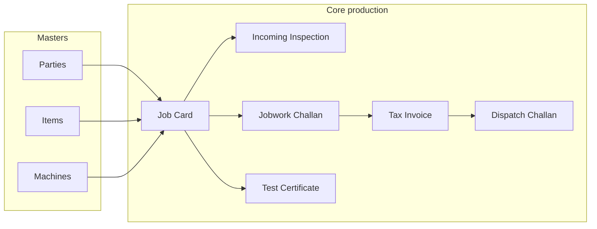

# Sheetal Dies ERP — End-to-end flow

This document describes how modules connect in **this codebase** (frontend routes + backend behaviour). Use it for onboarding, testing, and training.

---

## 1. Stack & entry points

| Layer | Technology |
|--------|------------|
| Frontend | React (Vite), `frontend/` — base path `/` |
| Backend | Node.js + Express, `backend/` — API prefix `/api` |
| Database | MySQL + Prisma (`backend/prisma/schema.prisma`) |
| Auth | JWT in `localStorage` (`erp_token`); roles gate some routes |

---

## 1.1 Data normalization standard (backend + frontend)

To keep request/response parsing consistent and reduce silent type bugs:

- **Backend:** use only `backend/src/utils/normalize.js` helpers:
  - `toInt()`, `toNum()`, `toPositiveIntOrNull()`, `toDateOrNull()`, `asArray()`
- **Frontend:** use only `frontend/src/utils/normalize.js` helpers:
  - `toInt()`, `toNum()`
- Avoid direct `parseInt()` / `parseFloat()` in app logic files.  
  Use helper functions for:
  - route/query/body ids
  - numeric form values
  - totals/tax calculations
  - pagination values
- If invalid input is possible, pass explicit fallback values in helper calls (example: `toInt(page, 1)`, `toNum(amount, 0)`).

This standard is now applied across backend controllers/routes and core frontend forms/lists.

---

## 2. User roles (RBAC)

Defined in Prisma `User.role`: **ADMIN**, **MANAGER**, **OPERATOR**, **VIEWER**.

| Area | Typical access |
|------|----------------|
| **Main** nav (Dashboard, Job Cards, Job Work, …) | Logged-in users |
| **Operations** sidebar section | **MANAGER** (and ADMIN) |
| **Admin** (Parties, Items, Machines, Process Pricing) | **MANAGER** / **ADMIN** as per route |
| **Users** | **ADMIN** only |
| **Job cards** create/update | **OPERATOR**+ (backend `requireRole('OPERATOR')`) |
| **Parties** create/update | **MANAGER**+ |

Exact checks live in `frontend/src/App.jsx` (`PrivateRoute`) and `backend/src/routes/*.routes.js`.

---

## 3. Master data (pehle yeh)

Before smooth operational flow, maintain:

| Master | UI route | Purpose |
|--------|----------|---------|
| **Parties** | `/admin/parties` | Customers, vendors, both — GSTIN and PAN unique (DB, normalized) |
| **Items** (parts) | `/admin/items` | Part numbers linked to job cards, challans, invoices |
| **Machines** | `/admin/machines` | Furnaces / lines — linked on job cards |
| **Process types & pricing** | `/admin/processes`, `/admin/pricing`, `/admin/price-card` | Certificates / invoices / jobwork pricing where used |

**Users** must exist to own created records (`createdById`). Helper: `npm run db:ensure-admin` in `backend/` (default `admin@sheetaldies.com` — override via env in script).

---

## 4. Recommended operational flow (heat-treat / job shop)

This is the **intended** sequence when work moves through your shop. Some steps are enforced by **job card status rules**; others are optional documents.

### 4.1 Step-by-step (happy path)

1. **Job Card** — `/jobcards` → New  
   - Party (bill-to), part, qty, machine, drawing no, dates, etc.  
   - Status starts **CREATED**.

2. **Status: CREATED → IN_PROGRESS**  
   - From list dropdown: `PATCH /api/jobcards/:id/status` with JSON `{ "status": "..." }` (no multipart).  
   - Full edit with photos: `PUT /api/jobcards/:id` (multipart).

3. **Optional: Jobwork challan** — `/jobwork/new`  
   - From / To parties, line items, optional **job card** link.  
   - If `jobCardId` is sent, backend sets job card to **SENT_FOR_JOBWORK**.

4. **Incoming inspection** — `/jobcards/:id/inspection`  
   - One inspection row per job card (unique `job_card_id`).  
   - Saving inspection (quality API) can set job card to **INSPECTION**.

5. **Status rules (strict transitions)** — enforced in `jobcard.controller.js`  
   - **CREATED** → **IN_PROGRESS** (or **ON_HOLD**)  
   - **IN_PROGRESS** → **SENT_FOR_JOBWORK** (or ON_HOLD)  
   - **SENT_FOR_JOBWORK** → **INSPECTION** (or ON_HOLD)  
  - **INSPECTION** → **COMPLETED** only if inspection status is **PASS** or **CONDITIONAL**
  - **INSPECTION** → **SENT_FOR_JOBWORK** for rework loop (allowed)
   - **ON_HOLD** → **CREATED** / **IN_PROGRESS** / **SENT_FOR_JOBWORK**  
   - **COMPLETED** → no further status changes  
   - Moving **to INSPECTION** requires an **inspection record** to exist.  
   - UI: Job Cards list has a **status dropdown** per row; invalid jumps show API error toast.

6. **Test certificate** — `/quality/certificates/new`  
   - Optional link to **job card**; **customer** party required.

7. **Tax invoice** — `/invoices/new`  
   - From/To parties; optional **jobwork challan** link (`challanId`).

8. **Dispatch challan** — `/dispatch`  
   - From/To parties, items; optional **jobwork challan** link.

9. **Inward / Outward register** — `/jobwork/register`  
   - Tracking view aligned with jobwork movement (not a full duplicate of challan lifecycle).

---

## 5. Parallel tracks (not every plant uses daily)

### 5.1 Purchase & stock

| Step | Route |
|------|--------|
| Purchase orders | `/purchase` |
| GRN (goods receipt) | `/purchase/grn` |
| Inventory snapshot | `/purchase/inventory` |

Links: PO → GRN → item inventory (see Prisma `PurchaseOrder`, `GRN`, `Inventory`).

### 5.2 Manufacturing / furnace

| Step | Route |
|------|--------|
| Manufacturing batches | `/manufacturing/batches` |
| VHT runsheet | `/manufacturing/runsheet` |
| Daily furnace planning | `/manufacturing/planning` |
| Mfg reports | `/manufacturing/reports` |

These tie to **machines**, **job cards** (e.g. planning slots, runsheet lines), and **batches** per schema.

### 5.3 Workflow engine (optional)

Prisma models: `WorkflowTemplate`, `JobWorkflow`, `JobStepTracking`.  
API under `/api/workflows` — used when templates are configured for guided steps.

---

## 6. Frontend route map (quick reference)

| Path | Screen |
|------|--------|
| `/` | Dashboard |
| `/jobcards`, `/jobcards/new`, `/jobcards/:id` | Job card list / form |
| `/jobcards/:id/inspection` | Incoming inspection |
| `/jobwork`, `/jobwork/new`, `/jobwork/:id/edit`, `/jobwork/:id` | Jobwork challans |
| `/jobwork/register` | Inward / outward register |
| `/quality/certificates` | Certificate list / CRUD / print |
| `/invoices`, `/invoices/new`, `/invoices/:id`, `.../print` | Invoices |
| `/dispatch`, `/dispatch/new`, `/dispatch/:id` | Dispatch |
| `/analytics`, `/analytics/advanced` | Analytics |
| `/admin/parties`, `.../:partyId` | Parties |
| `/admin/items`, `/admin/machines`, `/admin/pricing` | Masters |
| `/admin/processes`, `/admin/price-card` | ADMIN pricing tools |
| `/admin/users`, `/admin/audit-logs` | ADMIN |
| `/purchase/*`, `/manufacturing/*` | MANAGER operations |

Source: `frontend/src/App.jsx`, `frontend/src/components/Sidebar.jsx`.

---

## 7. Backend API map (high level)

Mounted in `backend/src/app.js`:

| Prefix | Domain |
|--------|--------|
| `/api/auth` | Login / JWT |
| `/api/jobcards` | Job cards + stats; quick status `PATCH /:id/status` |
| `/api/jobwork` | Jobwork challans; list `?seedDemo=hide|all|only`; status `PATCH /:id/status` |
| `/api/quality` | Inspection + certificates |
| `/api/invoices` | Tax invoices |
| `/api/dispatch-challans` | Dispatch |
| `/api/parties`, `/api/items`, `/api/machines` | Masters |
| `/api/purchase` | PO / GRN |
| `/api/manufacturing` | Batches / runsheets / plans |
| `/api/workflows` | Workflow templates / steps |
| `/api/audit` | Audit logs |
| `/api/analytics` | Dashboard analytics |
| `GET /api/health` | App up + MySQL ping (`db: "up"` or HTTP 503) |

**Production hardening:** `helmet` on API; login route rate-limited (see `auth.routes.js`).

---

## 8. Demo / seed scripts (`backend/`)

| NPM script | What it does |
|------------|----------------|
| `npm run db:ensure-admin` | Upsert default admin user |
| `npm run db:seed-parties` | Insert demo parties (skip duplicate GSTIN) |
| `npm run db:seed-machines` | Upsert 15 machines by code |
| `npm run db:seed-jobcards` | One job card per first 5 CUSTOMER / VENDOR / BOTH parties |
| `npm run db:assign-jobcard-machine-drawing` | Assign machines + drawing no to all job cards |
| `npm run db:advance-workflow` | Inspections + up to 3 **demo** jobwork challans (often **without** job card — list filler) |
| `npm run db:truncate` | Wipe app tables (`TRUNCATE_CONFIRM=yes`) |

**Note:** Demo jobwork rows from `db:advance-workflow` explain “empty Job Card column” in Job Work — they are intentional samples; real flow uses **New Challan** with **job card** selected.

---

## 9. Related documents

- Database structure: `backend/prisma/schema.prisma`
- Job card transition source of truth: `backend/src/controllers/jobcard.controller.js` (`validateStatusTransition`)

---

*Generated for the Sheetal Dies ERP project. Update this file when you add modules or change status rules.*
